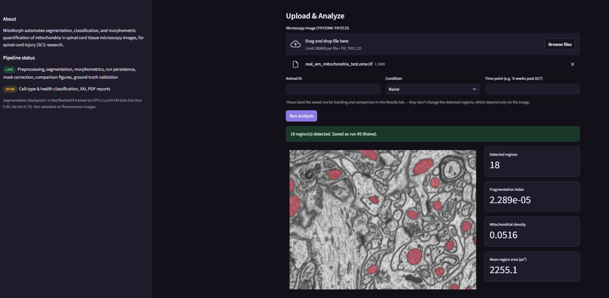
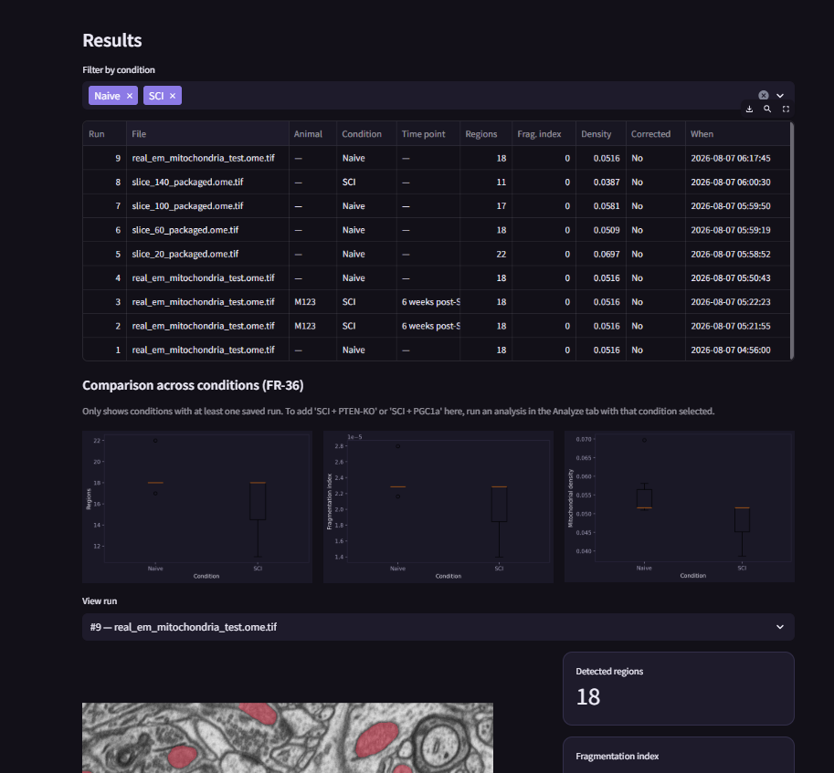
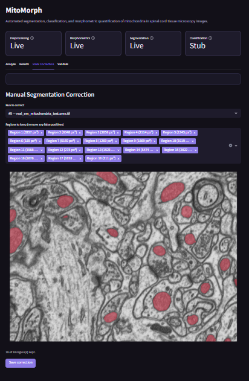
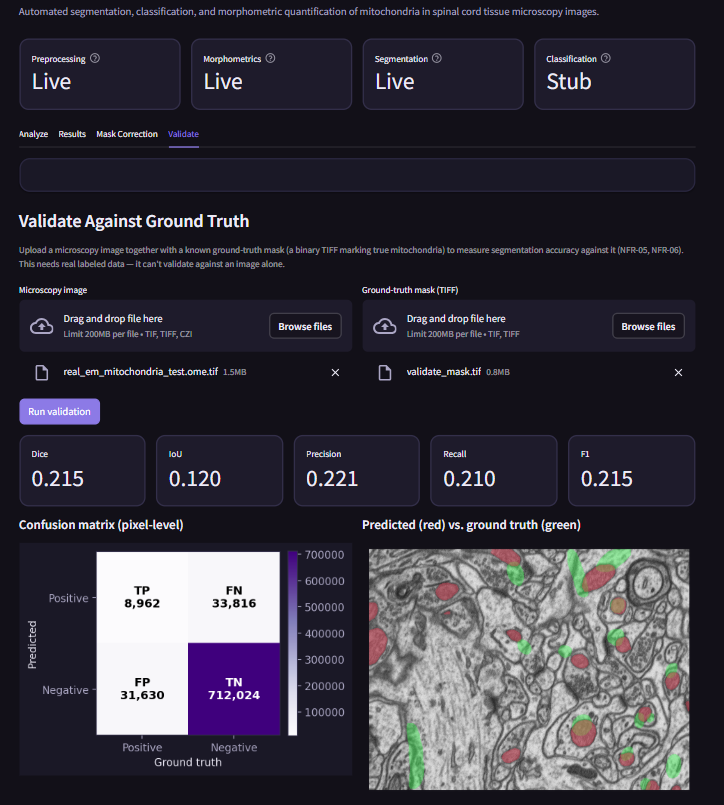

<div align="center">

# MitoMorph

**Automated Mitochondrial Morphology Analysis Pipeline**

An image analysis system for detecting, segmenting, and quantifying
mitochondria in spinal cord tissue microscopy images.

[](https://github.com/Somiyakhan10/Mitochondrial-Segmentation-with-Vision-Transformers/actions/workflows/pytest.yml)
[](https://github.com/Somiyakhan10/Mitochondrial-Segmentation-with-Vision-Transformers/actions/workflows/lint.yml)
[](https://www.python.org/downloads/)
[](LICENSE)
[](https://github.com/psf/black)

</div>

---
## Overview

MitoMorph automates a process that is otherwise done manually under a
microscope: identifying individual mitochondria in tissue images and
measuring their size, shape, and distribution. It combines a trained
deep learning segmentation model with a classical image-analysis
pipeline, exposed through both a command-line interface and an
interactive dashboard.

| Metric | Score |
|---|---|
| Dice coefficient | 0.949 |
| IoU | 0.902 |
| Precision | 0.918 |
| Recall | 0.981 |
| F1 | 0.949 |

---
## Output


**Analyze Tab**
Upload a microscopy image and run automated segmentation. The interface
displays the detected regions overlaid on the source image, live
morphometric statistics 



**Results Tab**
Every analysis run is saved automatically and listed in a searchable
table



**Mask Correction Tab**
Reject false-positive detections from an automated segmentation result,
with a live preview of the corrected mask before saving.



**Validate Tab**
Upload an image alongside a known ground-truth mask to compute Dice, IoU,
precision, recall, and F1 scores, along with a pixel-level confusion
matrix and a predicted-vs-ground-truth overlay.



---

## Key Capabilities

- **Multi-format image ingestion** — TIFF, OME-TIFF, and CZI microscopy
  formats, with automatic marker-channel identification from image
  metadata.
- **Deep learning segmentation** — U-Net/ResNet-34 architecture, trained
  and validated with quantitative accuracy metrics.
- **Morphometric quantification** — area, perimeter, circularity, aspect
  ratio, solidity, fragmentation index, and density, computed per
  detected region.
- **Interactive dashboard** — a four-tab Streamlit application covering
  analysis, results browsing, manual mask correction, and model
  validation.
- **Persistent result storage** — every analysis run is saved to a local
  database with its overlay image and statistics for later review and
  cross-condition comparison.

## Technology Stack

| Layer | Technology |
|---|---|
| Deep learning | PyTorch, torchvision |
| Image processing | scikit-image, OpenCV, tifffile |
| Classical ML | scikit-learn |
| Visualization | Matplotlib, Streamlit |
| Data storage | SQLite |
| Testing | pytest |
| Tooling | black, flake8, GitHub Actions |

## Getting Started

### Installation

```bash
python -m venv venv
venv\Scripts\activate          # Windows
# source venv/bin/activate     # macOS/Linux

pip install -r requirements-dev.txt
pip install -e .
```

### Usage

```bash
# Analyze a single image via the command line
mitomorph analyze path/to/image.tif --animal-id M123 --condition SCI --time-point "6 weeks"

# Batch-process a directory of images
mitomorph batch data/raw/ --output-dir data/processed/

# Launch the interactive dashboard
streamlit run dashboard/app.py

# Run the test suite
pytest
```

A trained segmentation checkpoint is required for segmentation to run.
`data/models/` is excluded from version control; place
`segmentation_unet.pt` there and the CLI and dashboard will pick it up
automatically. See [docs/user_guide.md](docs/user_guide.md) for complete
usage instructions, including how to obtain a validation image/mask
pair for the Validate tab.

```

## Testing

```bash
pytest
black --check src/ tests/
flake8 src/ tests/
```

## License

Distributed under the MIT License. See [LICENSE](LICENSE) for details.

## Acknowledgments

The segmentation model was trained on the EPFL CVLab Electron
Microscopy Dataset (Lucchi et al.), a publicly available benchmark for
mitochondria segmentation in electron microscopy volumes.
